# 📘 Day 2: 묘사(Description) 유형 만능 템플릿 & 입 트기

---

## 🎯 오늘(Day 2)의 학습 목표
1. OPIc 시험 첫 번째 문제로 가장 자주 나오는 **묘사(Description)** 유형 구조 파악하기
2. **현재 시제(Present Tense)** 및 분위기 형용사를 활용해 자연스럽게 입 떼기
3. '집/내 방 묘사' 실전 질문 연습하기

---

## 1. 묘사(Description) 유형 만능 4단계 프레임워크

묘사 문제는 대상을 카메라로 찍듯이 **전체적인 개요 ➔ 세부 특징 ➔ 내가 하는 행동 ➔ 총평** 순서로 말하는 것이 정석입니다.

```
[1. Intro] 대상 소개 및 위치/개요 
    ↓
[2. Body 1] 세부 특징 (인테리어, 분위기, 가구, 장비 등)
    ↓
[3. Body 2] 내가 그 공간/대상에서 자주 하는 일
    ↓
[4. Outro] 소감 및 총평 (나에게 주는 의미)
```

---

## 2. 묘사 필수 세트 표현 & Fillers

### 🎨 분위기/특징 표현 형용사
* `cozy and comfortable` (아늑하고 편안한)
* `modern and stylish` (모던하고 세련된)
* `spacious and bright` (넓고 밝은)
* `neat and organized` (깔끔하고 정돈된)

### 💬 묘사 시 입을 열어주는 핵심 구문
* **Intro**: `I'd like to tell you about...` / `Well, speaking of my [Topic]...`
* **Body 1**: `What I like most about it is...` / `It has a very cozy vibe.`
* **Body 2**: `Whenever I spend time there, I usually...`
* **Outro**: `All in all, it's my favorite place to recharge my batteries.`

---

## 3. 실전 예제: 내 방 묘사하기 (My Bedroom)

### ❓ Question
> **"You indicated in the survey that you live in an apartment. Can you describe your favorite room in your house in detail?"**  
> (서베이에서 아파트에 산다고 하셨는데, 집에서 가장 좋아하는 방을 자세히 묘사해 주시겠어요?)

---

### 📝 핵심 키워드 마인드맵 (외우지 말고 이 흐름으로 뱉기!)
1. **Intro**: 가장 좋아하는 공간은 **내 침실(Bedroom)** / 킹사이즈 침대 & 사이드 테이블 (충전기들)
2. **Body 1 (스마트 조명 & 실링 팬)**: 리모컨 조작 조명 + 실링 팬 조합 ➔ 여름에도 선풍기 없이 시원함 ➔ 아침 자동 조명 켜짐으로 기상
3. **Body 2 (전용 욕실)**: 방 안에 욕실(`en-suite bathroom`) 있음 ➔ 이른 아침 출근 준비 시 다른 가족 방해 안 함
4. **Body 3 (귀여운 고양이 에피소드)**: 잘 때 고양이들이 다리 사이에서 자곤 함 ➔ 귀엽지만 더워서 깨기도 함
5. **Outro**: 편안함과 귀여운 추억이 가득한 나만의 공간 (`super comfortable and convenient`)

---

### 🗣️ 맞춤 IH/AL 스크립트: 내 방 묘사하기 (소리 내어 읽어보세요!)

#### 1️⃣ Sentence 1
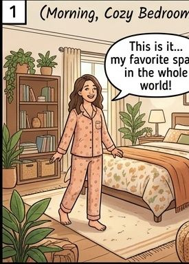
> **Well, speaking of my bedroom**, it's definitely my favorite space in the house.

#### 2️⃣ Sentence 2
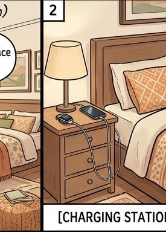
> I have a **king-size bed**, and right next to it, there's a small side table for my phone and smartwatch chargers.

#### 3️⃣ Sentence 3
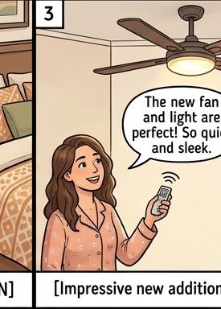
> **What's really cool is that** my room light has a **built-in ceiling fan** controlled by a remote.

#### 4️⃣ Sentence 4
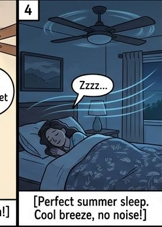
> Because of the ceiling fan, my room stays **very cool in the summer** even without a standing fan.

#### 5️⃣ Sentence 5
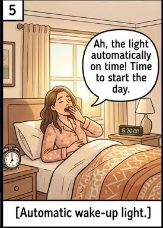
> Also, the light **turns on automatically every morning**, which helps me wake up right away.

#### 6️⃣ Sentence 6
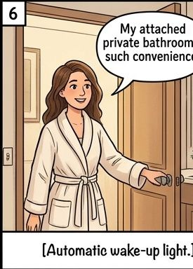
> **Another great thing is that** I have an **attached bathroom** in my room.

#### 7️⃣ Sentence 7
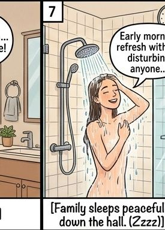
> Even when I wake up early to take a shower and get ready for work, **I don't disturb my family members** sleeping in other rooms.

#### 8️⃣ Sentence 8
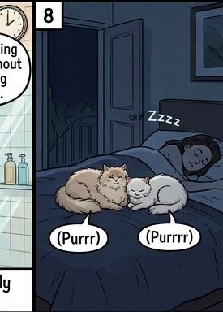
> Sometimes while I'm sleeping, my **cats sneak into my room** and sleep right between my legs.

#### 9️⃣ Sentence 9

> They are super cute, but I occasionally wake up in the middle of the night because **I feel too hot!**

#### 🔟 Sentence 10
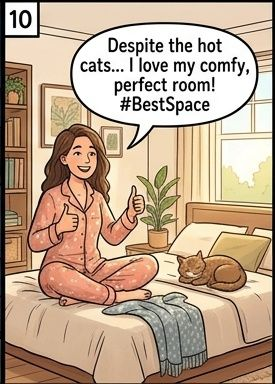
> **So, all in all**, my bedroom is **super comfortable and convenient** for my daily life. I just love spending time there.

---

## 4. 🎯 맞춤 실전 답변: 수변 공원 묘사 (Waterfront Park)

사용자님께서 제공해주신 내용으로 구성한 **OPIc IH/AL 등급 고득점 맞춤 스크립트**입니다.

### 🗣️ 추천 IH 맞춤 스크립트 (문장별 연상 그림과 함께 기억하기!)

#### 1️⃣ Sentence 1
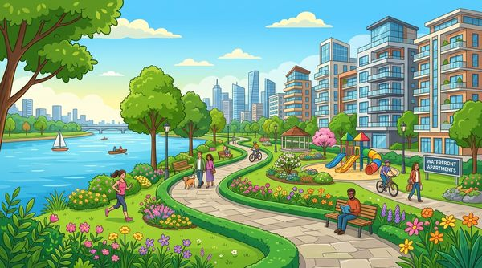
> **Well, speaking of my favorite park**, there is a lovely **waterfront park** located very close to my house.

#### 2️⃣ Sentence 2
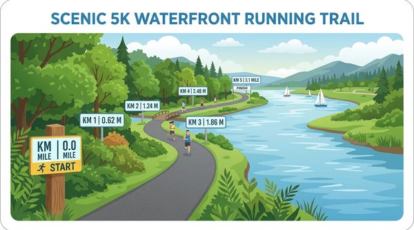
> It's quite long, and it **stretches for about 5 kilometers** along the water.

#### 3️⃣ Sentence 3
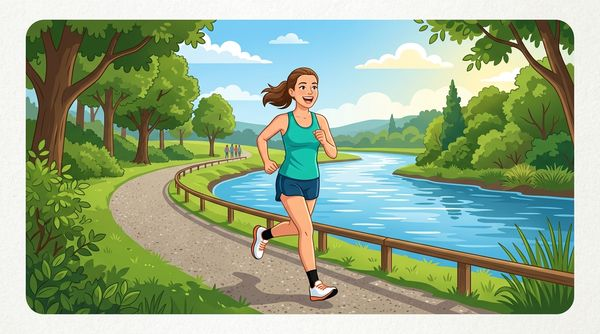
> **You know**, I visit this park **every single weekend to go jogging**.

#### 4️⃣ Sentence 4
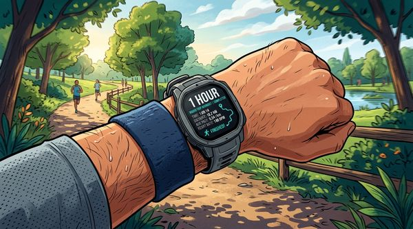
> A **round trip** usually takes me about **an hour**, which is just the right amount of exercise for me.

#### 5️⃣ Sentence 5
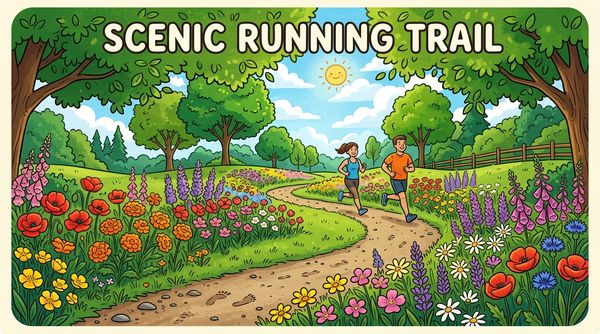
> **What I love most about this park is that** there are so many **beautiful flowers and lush trees** along the trail.

#### 6️⃣ Sentence 6

> Because the scenery is so nice, running there **never gets boring at all**.

#### 7️⃣ Sentence 7
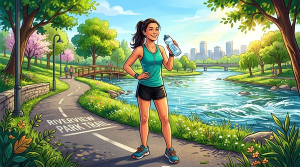
> **So, thanks to this park**, I think I am able to stick to my weekend running routine and **stay in shape**.

#### 8️⃣ Sentence 8
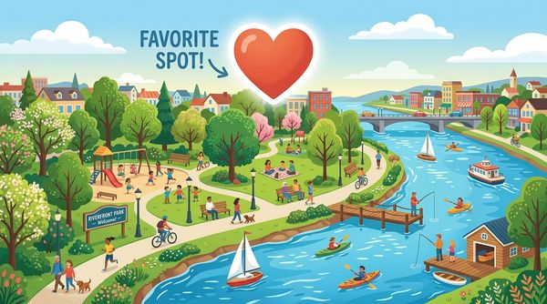
> It's definitely my favorite spot in my neighborhood.

---

## 💡 OPIc IH 포인트 원포인트 슨생님 피드백
1. **수변 공원 표현**: `waterfront park` 또는 `riverside park` (강변) / `lakeside park` (호수변) 중 실제 공원 모습에 맞게 단어를 쓰면 전달력이 훨씬 좋습니다.
2. **왕복 1시간 표현**: `A round trip takes about an hour` 표현은 단순 시량 표현보다 고급진 IH 문장입니다.
3. **추임새(Fillers)**: `Well, speaking of...`, `You know...`, `What I love most about... is...`, `So, thanks to this...` 와 같은 연결어휘가 입에서 자연스럽게 튀어나오도록 3회 이상 크게 읽어보세요!

