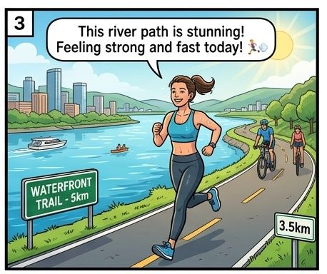
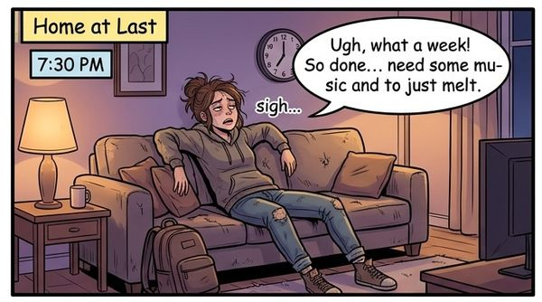
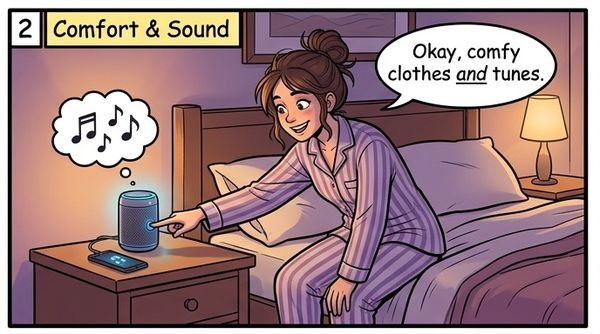
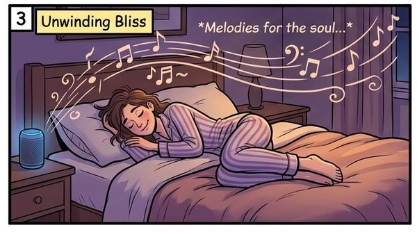
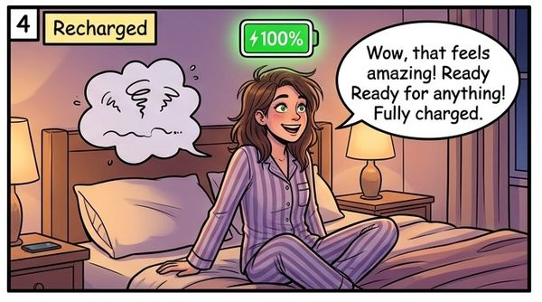

# 📘 Day 3: 루틴/습관(Routine) 유형 만능 템플릿 & 순서 접속사

---

## 🎯 오늘(Day 3)의 학습 목표
1. OPIc 시험에서 **묘사(1번)**에 이어 자주 출제되는 **루틴/습관(2번)** 유형 구조 파악하기
2. 시간의 흐름을 나타내는 **순서 접속사(Sequence Connectors)** 습관화하기
3. **'공원/조깅 루틴'** 및 **'음악 듣기/집 휴식 루틴'** 실전 스크립트 연습하기

---

## 1. 루틴(Routine) 유형 만능 4단계 프레임워크

루틴 문제는 **"시작부터 마무리까지의 시간적 순서"**를 매끄럽게 연결하는 것이 핵심입니다.

```
[1. Intro] 얼마나 자주/언제 주로 하는지 빈도 소개
    ↓
[2. Preparation] 출발 전/시작 전 준비하는 행동
    ↓
[3. Main Activity] 메인 활동을 시간 순서대로 진행 (First -> Next -> After that)
    ↓
[4. Outro] 마무리 후 느끼는 소감 및 정기적 의미
```

---

## 2. 루틴 필수 순서 접속사 & Fillers

### ⏱️ 시간 순서 연결 표현 (Sequence Connectors)
* `First of all, ...` (우선/첫 번째로)
* `Before heading out, ...` (밖으로 나가기 전에)
* `After that, ...` / `Once I get there, ...` (그 후에 / 일단 도착하고 나면)
* `Right after running, ...` (달리기를 마친 직후에)
* `Finally, ...` / `To wrap it up, ...` (마지막으로 / 마무리하며)

### 💬 루틴 시 입을 열어주는 핵심 구문
* **빈도 표현**: `I tend to go jogging once or twice a week.` (주 1~2회 조깅하곤 합니다.)
* **준비 표현**: `Before I leave the house, I make sure to...` (집을 나서기 전에 꼭~)
* **습관 표현**: `It has become an essential part of my weekly routine.` (주간 루틴의 핵심이 되었습니다.)

---

## 3. 실전 예제 1: 주말 수변 공원 조깅 루틴 (Park & Jogging Routine)

> 💡 Day 2에서 완성한 수변 공원 스토리를 **시간 순서 루틴**으로 확장한 IH/AL 맞춤 답변입니다!

### ❓ Question
> **"You indicated in the survey that you like going to parks. Can you tell me about your typical routine when you go to the park?"**  
> (공원에 가는 것을 좋아한다고 하셨는데, 공원에 갈 때 보통 어떤 루틴으로 활동하시나요?)

---

### 📝 핵심 키워드 마인드맵 (시간 순서)
1. **Intro**: 주말마다 주 1~2회 수변 공원 조깅 (`tend to visit every weekend`)
2. **Step 1 (준비)**: 러닝화 착용 & 무선 이어폰/스마트워치 챙기기 (`put on my running shoes & grab my wireless earbuds`)
3. **Step 2 (메인 활동)**: 5km 수변 산책로 따라 1시간 왕복 러닝 ➔ 중간에 시원한 물 마시기 (`run for about an hour round trip`)
4. **Step 3 (마무리)**: 쿨다운 걷기 후 집으로 복귀 (`do a light cooldown walk & head back home`)
5. **Outro**: 주말을 활기차게 시작하는 최고의 루틴 (`perfect way to kick off my weekend`)

---

### 🗣️ 실전 IH 맞춤 스크립트 (문장별 연상 그림과 함께 기억하기!)

#### 1️⃣ Sentence 1 (주말 공원 도착)

> **Well, as I mentioned before**, I tend to visit the waterfront park near my house **every single weekend**.

#### 2️⃣ Sentence 2 (러닝화 & 스마트워치 준비)

> **First of all**, before heading out, I put on my running shoes and **grab my wireless earbuds and smartwatch**.

#### 3️⃣ Sentence 3 (왕복 10km 러닝)

> **Once I get to the park**, I run the trail all the way and back — a **round trip of about 10 kilometers** in total.

#### 4️⃣ Sentence 4 (쿨다운 걷기 & 수분 섭취)

> **Right after running**, I do a light **cooldown walk** for about 5 minutes to catch my breath, and then I head back home.

#### 5️⃣ Sentence 5 (주말 활력 충전 소감)

> **All in all**, this running routine is the **perfect way to kick off my weekend** and stay healthy.

---

## 4. 실전 예제 2: 집에서 음악 듣기 & 휴식 루틴 (Music & Staycation Routine)

### ❓ Question
> **"Can you describe your routine when you listen to music at home?"**  
> (집에서 음악을 들을 때의 전형적인 루틴에 대해 말씀해 주시겠어요?)

---

### 🗣️ 실전 IH 맞춤 스크립트 (문장별 연상 그림과 함께 기억하기!)

#### 1️⃣ Sentence 1 (집에서 음악으로 휴식)

> **Well, whenever I want to unwind at home**, listening to music is my go-to routine.

#### 2️⃣ Sentence 2 (블루투스 스피커 ON)

> **First off**, I change into comfortable clothes and **turn on my Bluetooth speaker** in my bedroom.

#### 3️⃣ Sentence 3 (침대에 누워 어쿠스틱 음악 감상)

> **After that**, I usually lie down on my king-size bed and **play a playlist of soft acoustic music**.

#### 4️⃣ Sentence 4 (스트레스 해소 & 재충전)

> **So, to wrap it up**, listening to music at home really helps me **de-stress and recharge my batteries** after a long week.

---

## 📝 Day 3 실습 과제 (Action Item)

1. 위 두 가지 루틴 스크립트를 **순서 접속사(`First of all`, `After that`, `Right after`, `All in all`)**에 유의하며 **3번 크게 읽어보기**
2. 본인만의 주말 아침 또는 퇴근 후 10분 루틴을 영어 3문장으로 구성해 보기!
